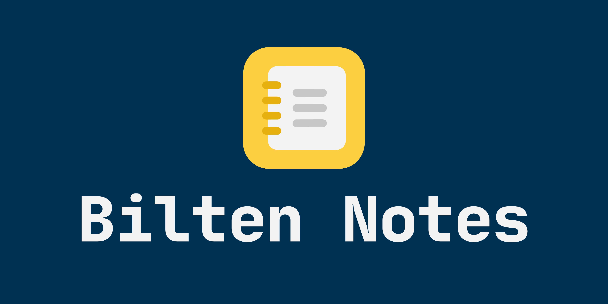
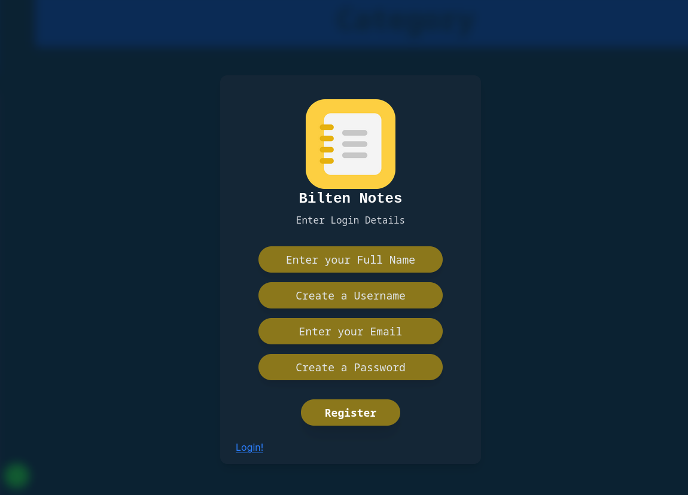
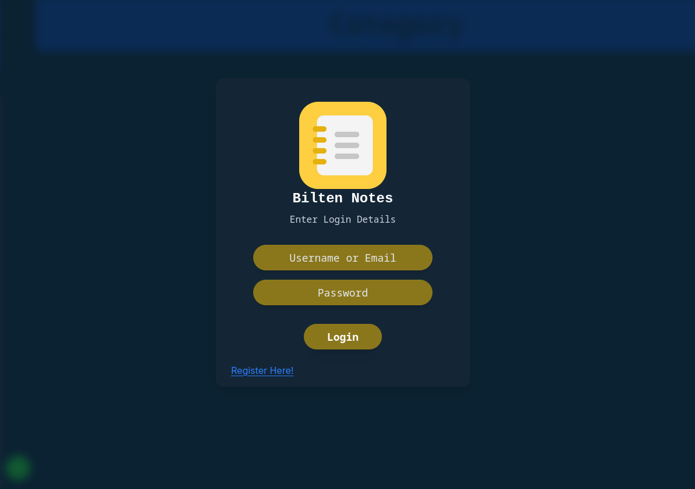
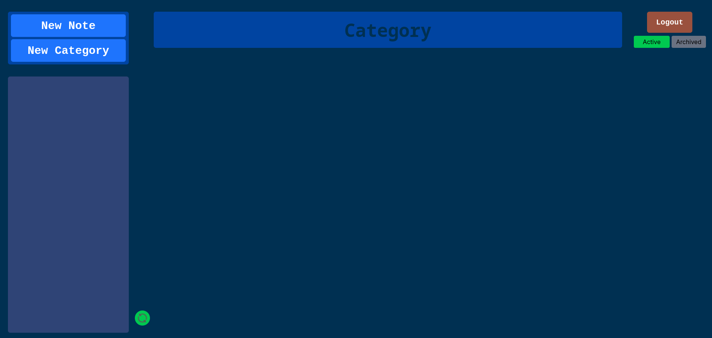
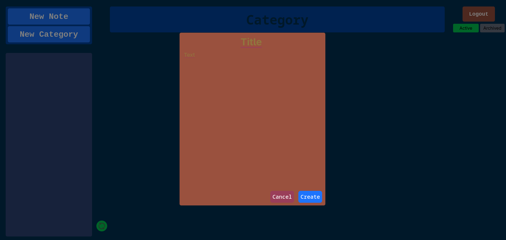

<h1 align="center">
  
  <br>
  Bilten Notes App
</h1>

<div align="center">
  <h3>A Full-Stack Notes Application with JWT Authentication, Archive/Unarchive, and Category Filtering</h3>
</div>

<div align="center">
  <a href="https://github.com/ludiux/hirelens-challenges/ferreyra-678304/issues/new?assignees=&labels=bug&template=01_BUG_REPORT.md&title=bug%3A+">Report a Bug</a>
  ·
  <a href="https://github.com/ludiux/hirelens-challenges/ferreyra-678304/issues/new?assignees=&labels=question&template=04_SUPPORT_QUESTION.md&title=support%3A+">Ask a Question</a>
</div>

<div align="center">
<br />

[](https://github.com/ludiux/hirelens-challenges/ferreyra-678304/issues?q=is%3Aissue+is%3Aopen+label%3A%22help+wanted%22)
[](https://github.com/ludiux)

</div>

<details open="open">
<summary>Table of Contents</summary>

- [About](#about)
- [Requirements Met](#requirements-met)
- [Built With](#built-with)
- [Architecture](#architecture)
- [Getting Started](#getting-started)
  - [Prerequisites](#prerequisites)
  - [Database Setup](#database-setup)
  - [Installation](#installation)
- [Usage](#usage)
  - [Default Test User](#default-test-user)
  - [How to Use](#how-to-use)
  - [API Endpoints](#api-endpoints)
- [Screenshots](#screenshots)
- [License](#license)
- [Acknowledgments](#acknowledgments)

</details>

---

## About

This is a Notes App Fullstack Project made for a Job Challenge for Ensolvers.

The application allows users to:
- Create, edit, and delete notes
- Archive and unarchive notes
- Create and manage categories
- Filter notes by category
- Authenticate using JWT tokens

## Built With

| Technology | Version |
|------------|---------|
| **Backend** | |
| Java | 17+ |
| Spring Boot | 3.x |
| Spring Security | 6.x |
| JWT | 0.11.5 |
| MySQL | 8.0+ |
| Maven | 3.8+ |
| **Frontend** | |
| Node.js | 18.x or 20.x |
| npm | 9.x or 10.x |
| React | 18.3+ |
| Vite | 5.x |
| Tailwind CSS | 3.x |
| Axios | 1.7+ |

---

## Architecture

This project follows **layered architecture** (Controller → Service → Repository):

```
┌─────────────────────────────────────────────────────────┐
│                    Frontend (React)                      │
│                  http://localhost:5173                   │
└─────────────────────────────────────────────────────────┘
                            │
                            │ HTTP/REST API
                            ▼
┌─────────────────────────────────────────────────────────┐
│                  Backend (Spring Boot)                   │
│                  http://localhost:8080                   │
│  ┌─────────────┐  ┌─────────────┐  ┌─────────────────┐  │
│  │ Controllers │→ │  Services   │→ │  Repositories   │  │
│  │ (REST API)  │  │ (Business)  │  │   (Database)    │  │
│  └─────────────┘  └─────────────┘  └─────────────────┘  │
└─────────────────────────────────────────────────────────┘
                            │
                            ▼
                    ┌─────────────┐
                    │   MySQL DB  │
                    └─────────────┘
```

### Layer Separation:
- **Controllers**: Handle HTTP requests/responses, JWT authentication, input validation
- **Services**: Business logic, transactions, permission checking
- **Repositories**: Database operations using Spring Data JPA

---

## Getting Started

### Prerequisites

Verify you have the following installed:

```bash
# Check Java version
java --version   # Should be 17 or higher

# Check Node.js version
node --version   # Should be 18.x or 20.x

# Check npm version
npm --version    # Should be 9.x or 10.x

# Check MySQL version
mysql --version  # Should be 8.0 or higher

# Check Maven version
mvn --version    # Should be 3.8 or higher
```

### Database Setup

1. **Start MySQL service:**
   ```bash
   # On Linux
   sudo systemctl start mysql
   
   # On macOS
   brew services start mysql
   
   # On Windows
   net start MySQL
   ```

2. **Create the database:**
   ```sql
   CREATE DATABASE notesdb;
   ```

3. **Database credentials (default):**
   ```
   Username: Dev
   Password: 1234
   ```

   > To change credentials, edit `backend/notesapp/src/main/resources/application.properties`

### Installation

#### Method 1: One-Command Setup (Recommended)

1. **Clone the repository:**
   ```bash
   git clone https://github.com/ludiux/hirelens-challenges/ferreyra-678304.git
   cd ferreyra-678304
   ```

2. **Make the start script executable and run it:**
   ```bash
   chmod +x start.sh
   ./start.sh
   ```

   The script will automatically:
   - Start the Spring Boot backend on port 8080
   - Start the React frontend on port 5173

#### Method 2: Manual Setup

**Backend:**
```bash
cd backend
mvn clean install
mvn spring-boot:run
```

**Frontend (in a new terminal):**
```bash
cd frontend
npm install
npm run dev
```

---

## Usage

### Default Test User
```
Username: testuser
Password: password123
```

> Register your own account if you prefer!

### How to Use

1. **Register** - Click "Register Here!" and create an account
2. **Login** - Use your credentials to login
3. **Create Note** - Fill in title and content, click "Create"
4. **Edit Note** - Click the "Edit" button on any note
5. **Delete Note** - Click the "Delete" button
6. **Archive/Unarchive** - Toggle between Active and Archived views
7. **Categories**:
   - Create categories in the category section
   - Click "Add Category" on any note
   - Select a category and confirm
   - Filter notes by clicking on a category name

### API Endpoints

#### Authentication
| Method | Endpoint | Description |
|--------|----------|-------------|
| POST | `/api/auth/register` | Register new user |
| POST | `/api/auth/login` | Login (returns JWT token) |

#### Notes
| Method | Endpoint | Description |
|--------|----------|-------------|
| GET | `/api/notes` | Get all notes |
| GET | `/api/notes/active` | Get active notes |
| GET | `/api/notes/archived` | Get archived notes |
| GET | `/api/notes/{id}` | Get note by ID |
| POST | `/api/notes` | Create a new note |
| PUT | `/api/notes/{id}` | Update a note |
| DELETE | `/api/notes/{id}` | Delete a note |
| PATCH | `/api/notes/{id}/archive` | Archive a note |
| PATCH | `/api/notes/{id}/unarchive` | Unarchive a note |

#### Categories
| Method | Endpoint | Description |
|--------|----------|-------------|
| GET | `/api/categories` | Get all categories |
| POST | `/api/categories` | Create a category |
| DELETE | `/api/categories/{id}` | Delete a category |
| POST | `/api/notes/{noteId}/categories/{categoryId}` | Add category to note |
| DELETE | `/api/notes/{noteId}/categories/{categoryId}` | Remove category from note |
| GET | `/api/notes/by-category/{categoryId}` | Get notes by category |

### Example API Calls

**Login:**
```bash
curl -X POST http://localhost:8080/api/auth/login \
  -H "Content-Type: application/json" \
  -d '{"identifier":"testuser","password":"password123"}'
```

**Create a note:**
```bash
curl -X POST http://localhost:8080/api/notes \
  -H "Authorization: Bearer YOUR_TOKEN" \
  -H "Content-Type: application/json" \
  -d '{"title":"My Note","content":"Note content here"}'
```

**Get active notes:**
```bash
curl -X GET http://localhost:8080/api/notes/active \
  -H "Authorization: Bearer YOUR_TOKEN"
```

---

## Screenshots

| Login Page | Register Page |
|:----------:|:-------------:|
|  |  |

| Active Notes | Archived Notes |
|:------------:|:--------------:|
|  |  |

---

## License

This project is licensed under the **GNU General Public License v3**.

See [LICENSE](LICENSE) for more information.

---

## Acknowledgments

- Challenge provided by **HireLens** for the **Ensolvers** job application
- [Spring Boot](https://spring.io/projects/spring-boot) - Backend framework
- [React](https://reactjs.org/) - Frontend library
- [Tailwind CSS](https://tailwindcss.com/) - Styling
- [JWT](https://jwt.io/) - Authentication

---

<div align="center">
  Made with ❤️ by <a href="https://github.com/ludiux">ludiux</a>

See [LICENSE](LICENSE) for more information.

